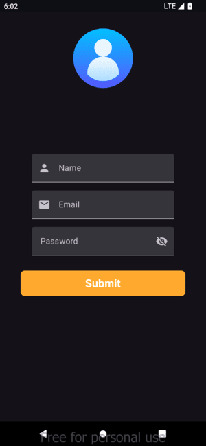
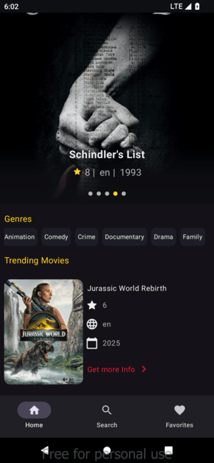
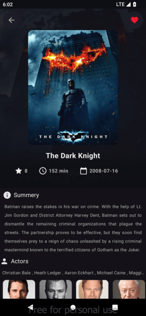
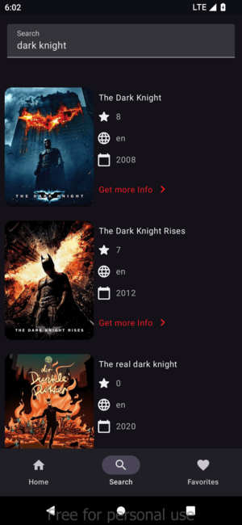
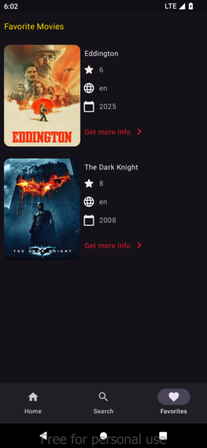

## Movie App 🎬
A modern Android application built with ***Jetpack Compose*** and ***MVVM architecture***. Browse movies, view detailed information, and manage your favorites — all in a clean and responsive UI powered by the latest Android development tools.

### 1. Features ✨

* 🎥 Browse and search movies
* 📄 View detailed information (cast, rating, synopsis, etc.)
* ❤️ Add/remove favorites
* 🔍 Search by title
* 📱 Responsive and smooth UI with Jetpack Compose
    

### 2. Screenshots 📷

### 3. Tech Stack 🛠

* Language: Kotlin
* UI: Jetpack Compose
* Architecture: MVVM 
* Networking: Retrofit / OkHttp 
* Dependency Injection: Hilt 
* Coroutines & Flow for async tasks
* local : Room / DataStore
* navigation : navigation Compose

